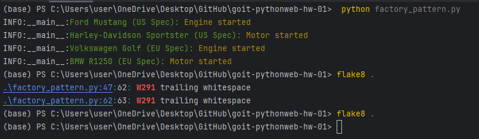
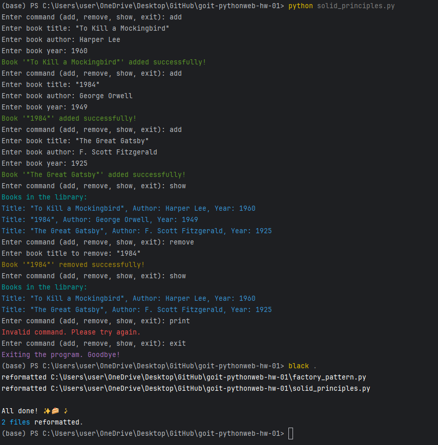

# Topic 1: Homework | Python Development

It's time for practice! The homework consists of two tasks.

For both tasks:
- Use **type annotations**.
- Replace the `print` operator with **logging** at the `INFO` level.
- Format the code using **black**.

---

## Technical Description of Tasks

## Task 1: Factory Pattern

The following code represents a simple system for creating vehicles. We have two classes: `Car` and `Motorcycle`. 
ach class has a `start_engine()` method that simulates starting the engine of the respective vehicle. 
Currently, to create a new vehicle, we simply instantiate the respective class with a given make and model.

#### Initial Code Example

```python
class Car:
    def __init__(self, make, model):
        self.make = make
        self.model = model

    def start_engine(self):
        print(f"{self.make} {self.model}: Engine started")

class Motorcycle:
    def __init__(self, make, model):
        self.make = make
        self.model = model

    def start_engine(self):
        print(f"{self.make} {self.model}: Engine started")

# Usage
vehicle1 = Car("Toyota", "Corolla")
vehicle1.start_engine()

vehicle2 = Motorcycle("Harley-Davidson", "Sportster")
vehicle2.start_engine()
```
The next step is to create vehicles based on regional specifications, e.g., US Spec or EU Spec.

### Your Task

Implement the **factory pattern** to allow the creation of vehicles with different regional specifications without modifying the core vehicle classes.

### Steps to Complete Task 1

1. **Create an abstract base class** `Vehicle` with a `start_engine()` method.
2. **Update the `Car` and `Motorcycle` classes** to inherit from `Vehicle`.
3. **Create an abstract class** `VehicleFactory` with methods `create_car()` and `create_motorcycle()`.
4. **Implement two factory classes**: `USVehicleFactory` and `EUVehicleFactory`. These factories should create cars and motorcycles with region-specific labels, e.g., `Ford Mustang (US Spec)` for the US.
5. **Update the initial code** to use the factories for vehicle creation.

### Expected Outcome

A codebase that enables easy creation of vehicles for different regions using the appropriate factories.

## Task 2: SOLID Principles
Below is a simplified program for managing a library of books. 
The program allows adding new books, removing books, and displaying all books 
in the library. Users can interact with the program via the command line using 
commands: add, remove, show, and exit.

#### Initial Code Example

```python
class Library:
    def __init__(self):
        self.books = []

    def add_book(self, title, author, year):
        book = {
            "title": title,
            "author": author,
            "year": year
        }
        self.books.append(book)

    def remove_book(self, title):
        for book in self.books:
            if book["title"] == title:
                self.books.remove(book)
                break

    def show_books(self):
        for book in self.books:
            print(f'Title: {book["title"]}, Author: {book["author"]}, Year: {book["year"]}')

def main():
    library = Library()

    while True:
        command = input("Enter command (add, remove, show, exit): ").strip().lower()
        
        if command == "add":
            title = input("Enter book title: ").strip()
            author = input("Enter book author: ").strip()
            year = input("Enter book year: ").strip()
            library.add_book(title, author, year)
        elif command == "remove":
            title = input("Enter book title to remove: ").strip()
            library.remove_book(title)
        elif command == "show":
            library.show_books()
        elif command == "exit":
            break
        else:
            print("Invalid command. Please try again.")

if __name__ == "__main__":
    main()
```
### Your Task

Refactor the code to adhere to the **SOLID principles**.

### Steps to Complete Task 2

1. **Single Responsibility Principle (SRP)**: Create a `Book` class to handle book information.
2. **Open/Closed Principle (OCP)**: Make the `Library` class extendable for new functionality without modifying its code.
3. **Liskov Substitution Principle (LSP)**: Ensure any class inheriting the `LibraryInterface` can replace the `Library` class without breaking the program.
4. **Interface Segregation Principle (ISP)**: Use a `LibraryInterface` to specify the methods required for library operations.
5. **Dependency Inversion Principle (DIP)**: Ensure high-level classes, such as `LibraryManager`, depend on abstractions (interfaces) rather than concrete implementations.

#### Example Code Structure

```python
from abc import ABC, abstractmethod

class Book:
    pass

class LibraryInterface(ABC):
    @abstractmethod
    def add_book(self, title: str, author: str, year: str) -> None:
        pass

    @abstractmethod
    def remove_book(self, title: str) -> None:
        pass

    @abstractmethod
    def show_books(self) -> None:
        pass

class Library(LibraryInterface):
    pass

class LibraryManager:
    def __init__(self, library: LibraryInterface):
        self.library = library

    def add_book(self, title: str, author: str, year: str) -> None:
        self.library.add_book(title, author, year)

    def remove_book(self, title: str) -> None:
        self.library.remove_book(title)

    def show_books(self) -> None:
        self.library.show_books()

def main():
    library = Library()
    manager = LibraryManager(library)

    while True:
        command = input("Enter command (add, remove, show, exit): ").strip().lower()

        match command:
            case "add":
                title = input("Enter book title: ").strip()
                author = input("Enter book author: ").strip()
                year = input("Enter book year: ").strip()
                manager.add_book(title, author, year)
            case "remove":
                title = input("Enter book title to remove: ").strip()
                manager.remove_book(title)
            case "show":
                manager.show_books()
            case "exit":
                break
            case _:
                print("Invalid command. Please try again.")

if __name__ == "__main__":
    main()
```
----

# TASK RESULTS

## Task 1: Factory Pattern



## Task 2: SOLID Principles


